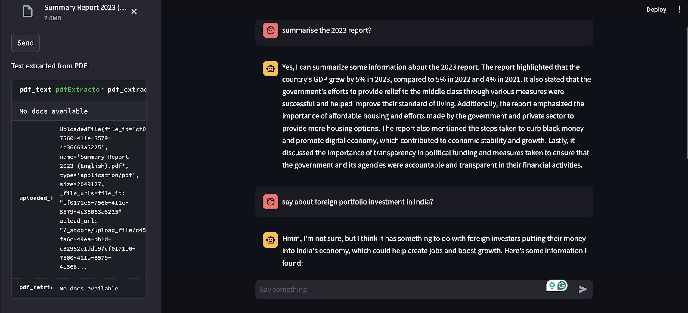

# pdfchat_phi2
---
 demo image

to run the streamlit app `streamlit run app.py`

please download phi2 GGUF format model here [https://huggingface.co/TheBloke/phi-2-GGUF/blob/main/phi-2.Q4_K_M.gguf](https://huggingface.co/TheBloke/phi-2-GGUF/blob/main/phi-2.Q4_K_M.gguf) (around 2gb)

Incase, you are running problem with installing LlamaCPP, please install CMAKE before trying. 
